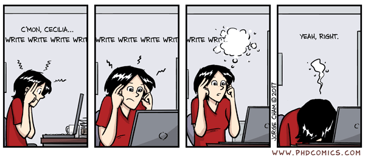

## Stuff for the semester

- Writer's workshop

## Stuff for the semester

- Writer's workshop
- Sabbatical
- Conferences
- Paul's travel
- Individual meetings
- Practice presentations

## Topic for Spring '17

**Why we're awesome**

Understanding and presenting the importance of what we do.

## Highlighting Success

- Fundamental problem
- Novel approach
- Unique expertise

## Highlighting Success

- Fundamental problem
    - What is the basic question that needs to be addressed?
- Novel approach
- Unique expertise

## Highlighting Success

- Fundamental problem
- Novel approach
    - What new approach are you using to overcome the problem?
- Unique expertise

## Highlighting Success

- Fundamental problem
- Novel approach
- Unique expertise
    - Why are you more qualified than anyone else to answer the question?
    - Why is your approach better than other approaches?
    
## Presentation Types

- Colleague Elevator Speech
- Citizen Elevator Speech
- 5-min Summary
- 5-min Funding Pitch
