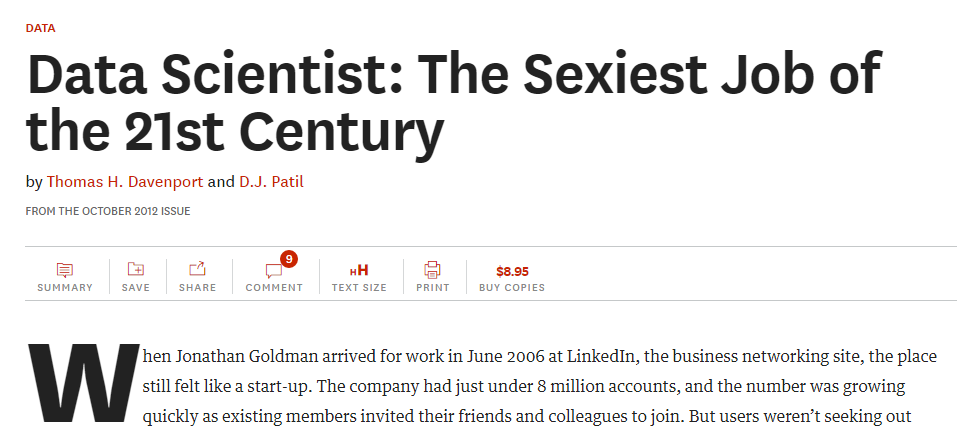
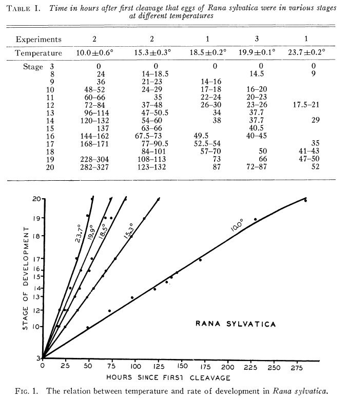
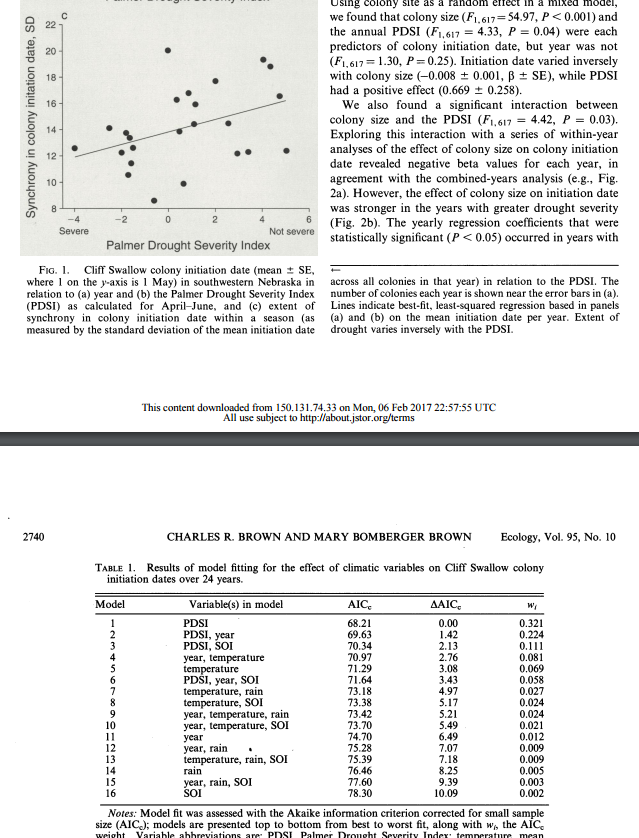
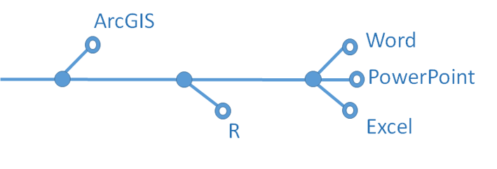
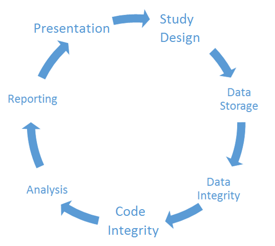
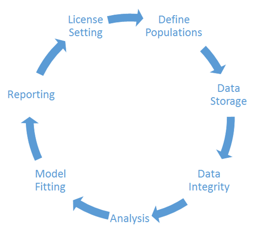
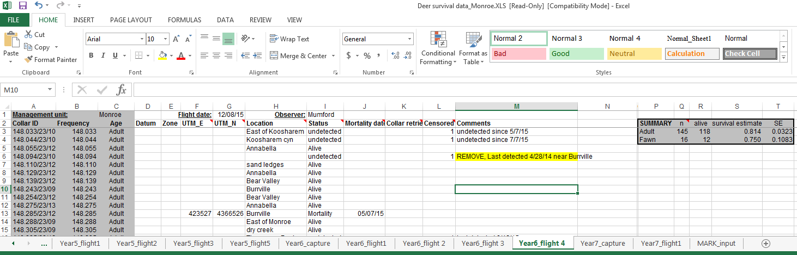
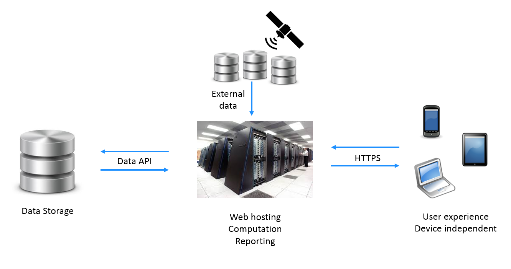
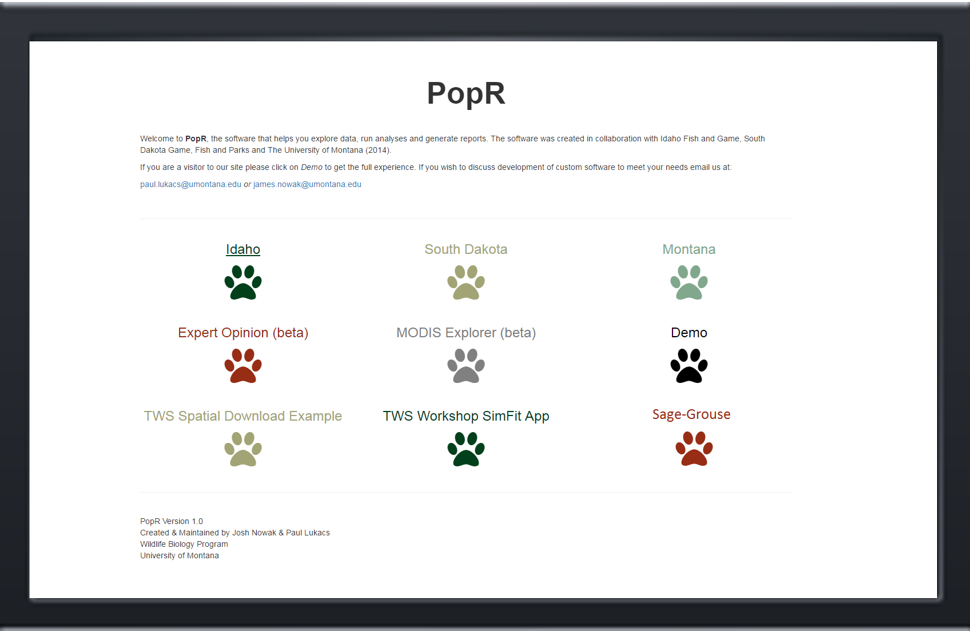

## 

<!-- 
## Goals 

- Provide background about what I do
- Highlight things we've learned
- Provide advice for data management

-->

## Wildlife Governance Principles

- Strategic and adaptive thinking
- Evidence-based and broadly informed decision-making
- Transparency and accountability for decisions and actions
- Inclusive and diverse participation in decision-making
- Capacity to deliver conservation

(Chris Smith, Wildlife Management Institute)

## 

Harvard Business Review 2012

## Reporting

<TABLE><TR>
  <TD></TD>
  <TD>

</TD>
  </TR>
  <TR>
  <TD>
  
  </TD>
  <TD>
  
  </TD>
  </TR>
</TABLE>

## Reporting

<TABLE><TR>
  <TD>
Ecology 1939</TD>
  <TD>
Ecology 2014
</TD>
  </TR>
  <TR>
  <TD>
  
  </TD>
  <TD>
  
  </TD>
  </TR>
</TABLE>

## Modernizing Workflow

<TABLE><TR>
  <TD>The old way...</TD>
  <TD></TD>
  </TR>
  <TR>
  <TD>
  
  </TD>
  <TD>
  
  </TD>
  </TR>
</TABLE>

## Modernizing Workflow

<TABLE><TR>
  <TD>The old way...</TD>
  <TD>
The modern way...
</TD>
  </TR>
  <TR>
  <TD>
  
  </TD>
  <TD>
  
  </TD>
  </TR>
</TABLE>

## Modernizing Workflow

<TABLE><TR>
  <TD>The old way...</TD>
  <TD>
The modern way...
</TD>
  </TR>
  <TR>
  <TD>
  
  </TD>
  <TD>
  
  </TD>
  </TR>
</TABLE>

## Smoothing the Workflow

- Where does it break?

## Common Data Pitfalls

- Labels contain information
    - File names
    - Field names

## Common Data Pitfalls

- Mixing rows and columns
    - Multiple headers

## Common Data Pitfalls

- Color codes

## Common Data Pitfalls

- Mixing raw data and summaries
    - Tables within sheets

## Data Solutions

- Long data
    - Disk space is cheap

## Data Solutions

- Think outside the rectangle
    - list-columns
    - NoSQL
    - XML
    - ...
    
## Data Solutions

- Data manipulations should be code driven
    - Maintain a base copy
    - All manipulations run off the base
    - Manipulations are temporary

## Code Integrity

- Version Control
    - GitHub
- Comments
- Naming conventions

## PopR

<!-- discuss the origins of PopR -->

## PopR

- Adaptive
- Evidence-based
- Transparent
- Inclusive
- Supports delivery

## Data Entry

<!-- show tablet app -->
<!-- show data entry page -->

## Data Visualization

<!-- harvest tab -->

## Data Integrity

<!-- survival tab -->

## Analysis

<!-- survival tab -->

## Hypothesis Driven Modeling

<!-- unit tab -->
<!-- survival tab -->
<!-- IPM tab -->

## Flexible Reporting

<!-- user driven tables -->

## Information Sharing

<!-- cougar data sharing -->

## Code Management

<!-- GitHub -->

## How does it all work?

## Questions?

